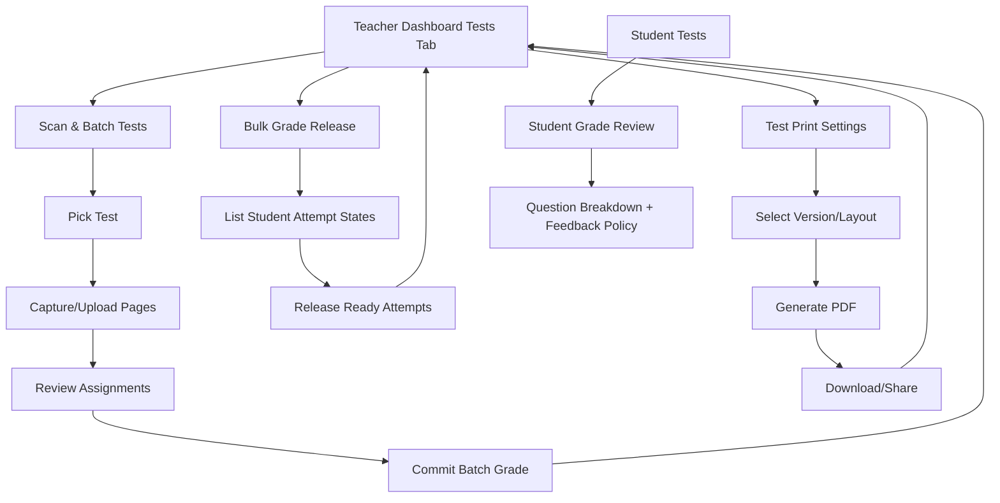

# feat: Align grading flows to Stitch screens

## Overview

Align teacher and student grading UX to the Stitch project `525946347121279815`, covering four target screens (`Scan & Batch Tests`, `Student Grade Review`, `Bulk Grade Release`, `Test Print Settings`) and incorporating the additional two project screens as style/layout reference for dashboard consistency.

## Problem Frame

Current mobile flows are functionally close but structurally mismatched with Stitch:
- Teacher test management currently mixes test list, submissions, release toggles, and grading actions in a single dense view.
- Scan & Batch Tests (existing stack grading) exists, but scan/review/release semantics are not modeled as clearly as Stitch’s intended flow.
- Student grade review exists but does not expose the same structured readiness/feedback controls shown in Stitch.
- Test print settings flow is missing.

The user requested significant flow changes, not just cosmetic updates, and explicitly asked to investigate all screens from the Stitch project first. Stitch assets were exported to `stitch_exports/525946347121279815/` and should serve as the visual source of truth for this plan.

## Requirements Trace

- R1. Use exported Stitch screens as implementation source-of-truth for flow and UI alignment.
- R2. Update relevant teacher flows to match Stitch intent for scan/batch grading and release workflows.
- R3. Add a print settings flow for tests aligned with Stitch.
- R4. Update student grade review to align with Stitch structure and controls.
- R5. Preserve data integrity and avoid regressions during flow reshaping.
- R6. Keep route/state transitions predictable across bottom-nav and nested screen flows.

## Scope Boundaries

- No backend rewrite in this plan; API and schema changes are additive and scoped to support new flow contracts.
- No redesign of auth/onboarding/marketing surfaces.
- No desktop/web-specific optimization beyond preserving existing route aliases.

## Context & Research

### Relevant Code and Patterns

- Teacher workspace shell and tabbed navigation:
  - `components/teacher/TeacherDashboard.tsx`
  - `components/teacher/DashboardNav.tsx`
- Teacher tests + submissions behavior:
  - `components/teacher/TestsView.tsx`
- Existing stack grading wizard:
  - `components/teacher/grade-wizard/use-stack-grade.ts`
  - `components/teacher/grade-wizard/GradeWizard.tsx`
  - `components/teacher/grade-wizard/StepPickTest.tsx`
  - `components/teacher/grade-wizard/StepUploadStack.tsx`
  - `components/teacher/grade-wizard/StepReviewMatches.tsx`
  - `components/teacher/grade-wizard/StepResults.tsx`
- Student result surfaces:
  - `components/student/StudentDashboard.tsx`
  - `components/student/TestList.tsx`
  - `components/student/AttemptDetailCard.tsx`
- Shared UI primitives:
  - `components/shared/ui.tsx`
- Shared type surfaces:
  - `lib/types.ts`
  - `lib/dashboard-types.ts`

### Institutional Learnings

- No `docs/solutions/` corpus exists in this repository, so no institutional citations are available.
- Planning implication: include explicit flow guards, state contracts, and regression scenarios in this plan rather than relying on prior solution docs.

### External References

- Stitch MCP screen exports and metadata:
  - `stitch_exports/525946347121279815/_screen_export_index.json`
  - `stitch_exports/525946347121279815/list_screens.json`
  - `stitch_exports/525946347121279815/*.get_screen.json`
  - `stitch_exports/525946347121279815/*.png`

## Key Technical Decisions

- **Introduce explicit flow screens for teacher test operations**: Split dense `TestsView` behavior into clearer subflows matching Stitch (scan/batch, bulk release, print settings) while keeping teacher dashboard as entry shell.
  - Rationale: aligns with requested significant flow changes and reduces state collision inside one component.

- **Adopt per-attempt release readiness/released status contract** (backed by API payloads), instead of relying only on test-level `grades_released`.
  - Rationale: Stitch bulk release screen is per-student/attempt stateful; test-wide boolean alone is too coarse.

- **Block duplicate student assignment in stack review before commit**.
  - Rationale: prevents accidental overwrites and aligns with safer batch grading semantics.

- **Treat feedback visibility as policy enforced on fetch** for student review.
  - Rationale: avoids stale/cached leakage if teacher toggles feedback visibility.

- **Add print settings as a dedicated route-level flow with explicit generation state machine**.
  - Rationale: Stitch design shows a focused task with preview/settings/download sequence, not inline toggle clutter.

- **Keep top-level bottom-nav model unchanged** (`Classes`, `Questions`, `Tests`, `Students`) and layer subflows inside the `Tests` domain.
  - Rationale: preserves global navigation familiarity while enabling deeper task flows.

- **Freeze API and state-persistence contracts before UI reshaping**.
  - Rationale: route transitions cannot preserve current local `TestsView` state unless persistence strategy and payload contracts are defined upfront.

## Open Questions

### Resolved During Planning

- **Should we investigate all Stitch project screens before planning?** Yes; all listed screens plus two additional screenshot-based screens were exported and analyzed from Stitch.
- **Should this be flow-level change or visual-only polish?** Flow-level changes are required (user request explicitly calls for significant flow changes).
- **How should route transitions preserve tests-subflow state?** Lift shared tests context to `TeacherDashboard` (or URL params for deep-linkable state) and treat `TestsView` local state as ephemeral UI only.
- **How should print flow dependencies be handled?** Add explicit print/file/share dependency setup as part of print-flow implementation, including platform-aware fallback behavior.

### Deferred to Implementation

- **Exact API endpoint names and payload key naming**: finalize during implementation, but contract shape is fixed in Unit 0.
- **Deterministic randomization strategy for print variants**: confirm backend seed/ordering mechanism.
- **Final migration cutoff date for removing test-level release fallback**: decide after rollout telemetry confirms parity.

## High-Level Technical Design

> *This illustrates the intended approach and is directional guidance for review, not implementation specification. The implementing agent should treat it as context, not code to reproduce.*

## Implementation Units

- [ ] **Unit 0: Freeze backend contracts, migration, and shared tests context model**

**Goal:** Remove architecture ambiguity before feature UI work by defining required contracts and state ownership boundaries.

**Requirements:** R2, R3, R4, R5, R6

**Dependencies:** None

**Files:**
- Modify: `lib/types.ts`
- Modify: `lib/dashboard-types.ts`
- Modify: `lib/dashboard-client.ts`
- Modify: `components/teacher/TeacherDashboard.tsx`
- Modify: `components/teacher/TestsView.tsx`
- Test: `components/teacher/__tests__/tests-state-contract.test.tsx`

**Approach:**
- Define request/response contract shapes for:
  - per-attempt release state (`ready|grading|released`),
  - bulk release action result (including partial failures),
  - print generation lifecycle (`idle|generating|ready|failed`) and artifact metadata.
- Capture those contract shapes in a lightweight integration note for the external backend owner and treat sign-off as a gate for Units 2-5.
- Define migration strategy for existing test-level release fields (dual-read precedence and rollback-safe fallback).
- Define which tests-domain states persist across route transitions (`selectedClassId`, selected test id, submissions filter), and where they live (`TeacherDashboard`/route params).

**Patterns to follow:**
- Existing typed payload usage through `handleJson` + shared `lib/*types*`.

**Test scenarios:**
- Happy path: contract mapper converts API payload into strongly typed release and print models used by views.
- Edge case: partial release response produces deterministic UI state for succeeded vs failed attempts.
- Edge case: missing optional migration fields still render with fallback behavior.
- Error path: malformed contract payload is rejected and surfaces recoverable status.
- Integration: persisted tests context survives route transition from tests list to subflows and back.

**Verification:**
- Downstream units can implement UI without redefining contracts or state ownership.

- [ ] **Unit 1: Formalize Stitch-to-app flow map and route topology**

**Goal:** Define and introduce route/view structure for the four Stitch target screens while preserving dashboard entry points.

**Requirements:** R1, R2, R3, R6

**Dependencies:** Unit 0

**Files:**
- Modify: `app/(teacher)/index.tsx`
- Modify: `app/(teacher)/grade.tsx`
- Create: `app/(teacher)/tests/bulk-release.tsx`
- Create: `app/(teacher)/tests/print-settings.tsx`
- Modify: `components/teacher/TeacherDashboard.tsx`
- Modify: `components/teacher/DashboardNav.tsx`
- Test: `components/teacher/__tests__/teacher-flow-routing.test.tsx`

**Approach:**
- Keep `Tests` as primary dashboard tab entry.
- Add route-driven subflows for bulk release and print settings to avoid overloading one giant tab component.
- Define back-navigation semantics from subflows to `Tests` state, with draft/dirty guards where needed.

**Patterns to follow:**
- Existing role group routing under `app/(teacher)/`.
- Existing safe-area and header/nav structure in teacher dashboard shell.

**Test scenarios:**
- Happy path: opening bulk release from tests tab lands on the new bulk release screen with correct selected test context.
- Happy path: opening print settings from tests tab lands on print settings screen with selected test context.
- Edge case: direct navigation to subflow route without test context redirects to tests tab with recoverable message.
- Error path: invalid test id in route params renders non-crashing fallback and return action.
- Integration: back from subflow returns to prior `Tests` filter/state rather than resetting entire dashboard.

**Verification:**
- Teacher can enter/exit each new subflow predictably; navigation stack and bottom-nav remain coherent.

- [ ] **Unit 2: Reshape Scan & Batch Tests flow to Stitch model**

**Goal:** Align Scan & Batch Tests (stack grading) UX to Stitch’s scan-first workflow and enforce assignment integrity constraints.

**Requirements:** R1, R2, R5, R6

**Dependencies:** Unit 1

**Files:**
- Modify: `components/teacher/grade-wizard/GradeWizard.tsx`
- Modify: `components/teacher/grade-wizard/use-stack-grade.ts`
- Modify: `components/teacher/grade-wizard/StepPickTest.tsx`
- Modify: `components/teacher/grade-wizard/StepUploadStack.tsx`
- Modify: `components/teacher/grade-wizard/StepReviewMatches.tsx`
- Modify: `components/teacher/grade-wizard/StepResults.tsx`
- Modify: `lib/types.ts`
- Test: `components/teacher/grade-wizard/__tests__/use-stack-grade.test.ts`
- Test: `components/teacher/grade-wizard/__tests__/GradeWizard.test.tsx`

**Approach:**
- Update UI sequence to emphasize batch scan mode and per-student page grouping cues from Stitch.
- Add duplicate-student assignment validation before commit.
- Define partial-failure commit handling contract for retryability (failed subset only).
- Preserve explicit restart/back actions and improve non-destructive exit behavior.

**Execution note:** Start with failing tests for duplicate assignment prevention and partial commit handling.

**Patterns to follow:**
- Existing wizard-state approach in `use-stack-grade.ts`.
- Existing `StatusBanner` and card-based interaction styles.

**Test scenarios:**
- Happy path: teacher scans pages, resolves matches, commits batch, and sees results summary.
- Edge case: same student selected for multiple pages is blocked with clear error and no commit.
- Edge case: no assignments selected prevents commit and preserves current review state.
- Error path: OCR preview failure returns user to upload step with recoverable retry.
- Error path: commit partial failure returns per-student failure set and allows retry of failed subset.
- Integration: roster fetch + assignment commit operate against selected class/test only.

**Verification:**
- Batch grading flow mirrors Stitch sequence and cannot silently corrupt assignments.

- [ ] **Unit 3: Implement Bulk Grade Release flow with per-attempt state**

**Goal:** Add Stitch-aligned bulk release UX (`Ready`, `Grading`, `Released`) with safe bulk action semantics.

**Requirements:** R1, R2, R5, R6

**Dependencies:** Unit 1

**Files:**
- Create: `components/teacher/BulkGradeReleaseView.tsx`
- Modify: `components/teacher/TestsView.tsx`
- Modify: `lib/dashboard-types.ts`
- Modify: `lib/types.ts`
- Modify: `lib/dashboard-client.ts`
- Test: `components/teacher/__tests__/BulkGradeReleaseView.test.tsx`

**Approach:**
- Add per-attempt release state model to teacher-facing list payloads.
- Implement release action targeting only `Ready` attempts; never include `Grading`.
- Surface completion metrics (`X graded / Y total`) and partial-result responses.
- Keep existing test-level release toggles only if needed for backward compatibility; otherwise consolidate UX around attempt-level state.

**Patterns to follow:**
- Existing teacher tests cards and badge patterns in `components/teacher/TestsView.tsx`.

**Test scenarios:**
- Happy path: bulk release processes only `Ready` attempts and updates UI to `Released`.
- Edge case: no ready attempts disables primary action and shows explanatory empty state.
- Edge case: mixed statuses (Ready/Grading/Released) preserve each row state after release call.
- Error path: release API failure leaves prior states intact and surfaces retry action.
- Integration: teacher release action changes student-visible review availability for affected attempts.

**Verification:**
- Teacher can release eligible grades in one action without releasing in-progress attempts.

- [ ] **Unit 4: Implement Test Print Settings flow**

**Goal:** Introduce Stitch-aligned print settings experience (version/layout/answer-key + PDF generation/download).

**Requirements:** R1, R3, R5, R6

**Dependencies:** Unit 1

**Files:**
- Create: `components/teacher/TestPrintSettingsView.tsx`
- Modify: `components/teacher/TestsView.tsx`
- Modify: `lib/types.ts`
- Modify: `lib/dashboard-types.ts`
- Test: `components/teacher/__tests__/TestPrintSettingsView.test.tsx`

**Approach:**
- Add settings form with version selector, include-answer-key toggle, layout settings entry, and download CTA.
- Model print lifecycle states: `idle -> generating -> ready|failed`.
- Add print/file/share dependency setup (`expo-print`, `expo-file-system`, `expo-sharing` or equivalent) with platform-specific fallback behavior.
- Ensure settings and generation are scoped to selected test id and recover cleanly on navigation away/back.

**Patterns to follow:**
- Existing card/form controls from shared UI primitives.
- Existing teacher test action button conventions.

**Test scenarios:**
- Happy path: teacher configures settings and successfully downloads generated PDF.
- Edge case: no selectable versions renders disabled generator with explanatory copy.
- Edge case: toggling include-answer-key persists in request payload.
- Error path: generation failure shows retry path without losing selected settings.
- Integration: returning from print settings to tests preserves selected class/test context.

**Verification:**
- Teacher can configure and generate printable test outputs from a dedicated flow.

- [ ] **Unit 5: Align Student Grade Review to Stitch**

**Goal:** Redesign student result detail and list interactions to match Stitch layout and policy semantics.

**Requirements:** R1, R4, R5, R6

**Dependencies:** Unit 3

**Files:**
- Modify: `components/student/StudentDashboard.tsx`
- Modify: `components/student/TestList.tsx`
- Modify: `components/student/AttemptDetailCard.tsx`
- Modify: `lib/dashboard-types.ts`
- Test: `components/student/__tests__/TestList.test.tsx`
- Test: `components/student/__tests__/AttemptDetailCard.test.tsx`

**Approach:**
- Update result presentation hierarchy (score prominence, readiness copy, question cards, feedback blocks) to Stitch.
- Enforce release/feedback visibility from API response contract; do not render hidden feedback.
- Ensure unreleased attempts show a stable “awaiting release” status and suppress score breakdown.

**Patterns to follow:**
- Existing student two-tab shell and result-card composition.

**Test scenarios:**
- Happy path: released graded attempt shows score and question breakdown.
- Edge case: graded but unreleased attempt appears with awaiting-release state and no score details.
- Edge case: feedback disabled by teacher hides feedback section but keeps marks.
- Error path: attempt detail fetch failure leaves user on tests list with recoverable message.
- Integration: teacher release/feedback actions are reflected in student detail on next fetch.

**Verification:**
- Student review flow matches Stitch and respects release/feedback policy boundaries.

- [ ] **Unit 6: Test harness bootstrap and cross-flow integration coverage**

**Goal:** Establish and apply automated test coverage for new route/flow/state contracts.

**Requirements:** R5, R6

**Dependencies:** Units 1-5

**Files:**
- Create: `jest.config.ts`
- Create: `jest.setup.ts`
- Modify: `package.json`
- Create: `components/__tests__/grading-flow-integration.test.tsx`

**Approach:**
- Add RN test harness if absent.
- Ensure unit-specific tests from Units 0-5 are runnable in one test pipeline.
- Add cross-flow integration tests for route transitions and teacher->student policy propagation.

**Patterns to follow:**
- Existing TypeScript + component architecture conventions.

**Test scenarios:**
- Happy path: all primary screen entry points render with valid context.
- Edge case: missing route context for subflows redirects safely.
- Edge case: back-navigation from each subflow preserves expected parent state.
- Error path: API error surfaces status banner and keeps interaction recoverable.
- Integration: teacher release and feedback toggles propagate to student-visible result states.

**Verification:**
- CI-local test suite catches regressions across the redesigned grading flows.

## System-Wide Impact

- **Interaction graph:** Teacher `Tests` domain now fans out into scan/batch, bulk release, and print settings subflows; student results consume release/feedback policy outputs from teacher actions.
- **Error propagation:** Async failures must remain non-fatal and recoverable via status banners and localized retry controls.
- **State lifecycle risks:** stale selected test/class context, duplicate assignment in batch grading, and partial-release updates are the highest-risk mutation states.
- **API surface parity:** existing test/attempt payloads may need additive fields for per-attempt release readiness and print settings.
- **Integration coverage:** flow transitions across route-level subviews and policy propagation from teacher to student require cross-component tests.
- **Unchanged invariants:** role-based entry routes (`/(teacher)`, `/(student)`), top-level bottom-nav taxonomy, and authenticated fetch mechanism (`useGraiderFetch`) remain intact.

## Risks & Dependencies

| Risk | Mitigation |
|------|------------|
| Backend does not yet expose per-attempt release state | Implement additive API contract and keep fallback compatibility with current test-level flags until backend is updated |
| Batch grading duplicate assignments cause data corruption | Add pre-commit duplicate validation in UI and server-side rejection contract |
| Flow rewrite introduces navigation regressions | Route-level tests + explicit back/exit semantics before UI polish |
| Print generation latency/failures degrade UX | Model async generation state with retry and resilient return paths |
| Student visibility inconsistency for release/feedback | Enforce policy at detail-fetch rendering boundary and test propagation scenarios |

## Documentation / Operational Notes

- Add a short developer note documenting new grading subflow routes and expected payload contracts.
- Capture Stitch screen-to-component mapping in `stitch_exports/525946347121279815/` as implementation reference.

## Sources & References

- Stitch project metadata: `stitch_exports/525946347121279815/list_screens.json`
- Stitch export index: `stitch_exports/525946347121279815/_screen_export_index.json`
- Follow-on async queue plan: `docs/plans/2026-05-28-002-feat-bullmq-grading-service-plan.md`
- Stitch target screens:
  - `stitch_exports/525946347121279815/scan-batch-tests-eda0ad486d75440fab7028e8ec5c49d4.png`
  - `stitch_exports/525946347121279815/student-grade-review-2ceec900138f42a7a8a1aeaacbaee638.png`
  - `stitch_exports/525946347121279815/bulk-grade-release-7d6d4492e95f4835aff0dcb33063ba50.png`
  - `stitch_exports/525946347121279815/test-print-settings-847cf07ccbd745ff877ef4d32e139bef.png`
- Additional reference screens:
  - `stitch_exports/525946347121279815/screenshot-2026-05-28-at-6-32-05-am-png-15297591760856015972.png`
  - `stitch_exports/525946347121279815/screenshot-2026-05-28-at-6-34-56-am-png-15297591760856016090.png`
