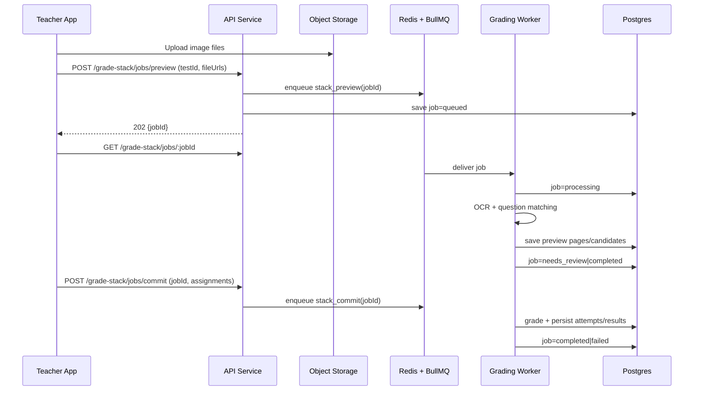

# feat: Render-hosted async grading queue service

## Overview

Move stack grading from synchronous request/response into an async job system (BullMQ or equivalent) hosted on Render so large image uploads and OCR/grading workloads no longer fail with request-size/time limits.

## Problem Frame

Current grade stack flow posts large multipart payloads directly to API endpoints and waits for OCR + grading in-band. This causes `Request entity too large`, increased timeout risk, and poor UX for multi-page batch grading. The service should accept uploads quickly, enqueue work, and let the client poll for progress/results.

## Requirements Trace

- R1. Large grading uploads do not fail due to API request-body limits.
- R2. OCR + matching + grading executes asynchronously with durable retries.
- R3. Teacher UI can observe job status (queued, processing, needs review, done, failed).
- R4. Multi-page tests map OCR answers to the correct question definitions reliably.
- R5. Partial failures are visible and recoverable without re-uploading everything.

## Scope Boundaries

- This plan covers queue/service architecture, contracts, and integration strategy.
- This plan does not require implementing Redis/worker code in this mobile repo.
- Existing grading rubric logic remains source-of-truth; queueing changes execution mode, not grading semantics.

## Context & Research

### Relevant Code and Patterns

- `components/teacher/grade-wizard/use-stack-grade.ts` currently sends multipart form data directly to `/api/grade/stack`.
- `components/teacher/grade-wizard/StepUploadStack.tsx` currently stages files client-side and now enforces size guardrails.
- `lib/stack-grading.ts` already contains OCR answer normalization/matching logic that can be reused by workers.
- Existing `release_status` and batch grading flows show a pattern for async state surfaces in UI (`components/teacher/BulkGradeReleaseView.tsx`, `components/teacher/TestDetailView.tsx`).

### Institutional Learnings

- The previous grading flow alignment plan already split preview vs commit phases; this becomes queue-friendly by turning both into job phases.

### External References

- [BullMQ docs](https://docs.bullmq.io/)
- [Render Background Workers](https://render.com/docs/background-workers)
- [Render Redis](https://render.com/docs/redis)

## Key Technical Decisions

- **Use object storage + queue pointers, not raw image payloads in jobs**: upload images first, enqueue metadata/URLs only.
- **Split work into two job types**: `stack_preview` (OCR + candidate matching) and `stack_commit` (grade + persist).
- **Use deterministic page/question anchors for multi-page tests**: each OCR answer is matched against test question IDs via normalized prompt keys + optional page/question index hints.
- **Persist job state in DB**: queue provides execution, DB provides product-facing status/history for polling and audit.
- **Use idempotency keys per teacher/test/upload set**: prevents duplicate grading from retries or double taps.

## Open Questions

### Resolved During Planning

- **Can multi-page tests be mapped reliably?** Yes, if each OCR answer is normalized and mapped to canonical `question_id` using layered matching:
  1) explicit OCR index markers (`Q1`, `Question 2`) when present,  
  2) normalized prompt text lookup,  
  3) fuzzy fallback with confidence threshold and `needs_review` flag.

### Deferred to Implementation

- Exact Redis sizing and concurrency limits on Render (depends on observed OCR latency and worker memory footprint).
- Final choice between BullMQ vs managed alternatives (Cloud Tasks/SQS) if Redis ops burden becomes unacceptable.

## High-Level Technical Design

> This illustrates the intended approach and is directional guidance for review, not implementation specification. The implementing agent should treat it as context, not code to reproduce.

## Implementation Units

- [x] **Unit 1: Define async grading contracts and state model**

**Goal:** Establish shared contracts for queued grading jobs and phase/state semantics.

**Requirements:** R2, R3, R5

**Dependencies:** None

**Files:**
- Modify: `lib/types.ts`
- Modify: `lib/dashboard-types.ts`
- Modify: `docs/plans/2026-05-28-001-feat-stitch-grading-flow-alignment-plan.md` (cross-reference update)
- Test: `components/teacher/__tests__/tests-state-contract.test.ts`

**Approach:**
- Introduce job entities: `GradeStackJob`, `GradeStackJobPhase`, `GradeStackJobStatus`.
- Add per-page/per-student result envelopes including recoverable failure reasons.
- Define client polling payload shape and terminal/non-terminal states.

**Patterns to follow:**
- Existing `release_status` compatibility helpers in `lib/dashboard-client.ts`.

**Test scenarios:**
- Happy path: status transitions queued -> processing -> completed are representable.
- Edge case: partial failure includes successful rows and failed rows in one payload.
- Error path: failed job preserves reason and retryability flag.

**Verification:**
- Shared types support both preview and commit phases without `any` escapes.

- [x] **Unit 2: Design API contracts for enqueue + status + commit**

**Goal:** Specify HTTP surface that decouples upload from processing.

**Requirements:** R1, R2, R3

**Dependencies:** Unit 1

**Files:**
- Create: `docs/api/grade-stack-jobs.md`
- Modify: `components/teacher/grade-wizard/use-stack-grade.ts` (contract consumer notes)
- Test: `components/__tests__/grading-flow-integration.test.tsx`

**Approach:**
- Define:
  - `POST /api/grade-stack/jobs/preview`
  - `GET /api/grade-stack/jobs/:jobId`
  - `POST /api/grade-stack/jobs/commit`
- Require idempotency token on enqueue.
- Return `202` for async acceptance and explicit polling cadence guidance.

**Patterns to follow:**
- Existing fetch/error handling style in `lib/dashboard-client.ts` and `useGraiderFetch`.

**Test scenarios:**
- Happy path: create preview job returns job ID and queued status.
- Edge case: duplicate idempotency key returns existing job ID.
- Error path: invalid test or missing files returns validation error.
- Integration: commit endpoint rejects if preview phase not completed.

**Verification:**
- Contract doc is sufficient for backend + app teams to implement independently.

- [x] **Unit 3: Worker-side multi-page question matching strategy**

**Goal:** Ensure OCR answers from multi-page uploads map to canonical test questions accurately.

**Requirements:** R4, R5

**Dependencies:** Unit 1, Unit 2

**Files:**
- Modify: `lib/stack-grading.ts`
- Create: `docs/architecture/multi-page-question-matching.md`
- Test: `components/__tests__/grading-flow-integration.test.tsx`

**Approach:**
- Formalize 3-stage matching pipeline:
  - parse structural hints (page number/question number),
  - normalized prompt key lookup,
  - fuzzy fallback with confidence threshold.
- Persist `matching_reason` and `confidence` per answer for review tooling.
- Mark low-confidence rows as `needs_review` instead of forcing incorrect auto-grade.

**Patterns to follow:**
- Existing normalization helpers in `lib/stack-grading.ts`.

**Test scenarios:**
- Happy path: two-page test with stable question prompts maps all answers correctly.
- Edge case: OCR drops punctuation/case still maps via normalization.
- Edge case: duplicated prompt fragments across pages uses index hint to disambiguate.
- Error path: low-confidence unmatched answer is flagged for review, not silently graded.
- Integration: commit job consumes reviewed assignments and persists correct `question_id`.

**Verification:**
- Matching logic reports deterministic mappings and review-required cases distinctly.

- [x] **Unit 4: Queue runtime blueprint for Render (BullMQ baseline)**

**Goal:** Define deployable architecture for API + worker + Redis + storage on Render.

**Requirements:** R1, R2, R5

**Dependencies:** Unit 2

**Files:**
- Create: `docs/ops/render-bullmq-grading-service.md`
- Create: `.env.example` (queue/storage vars)
- Test expectation: none -- architecture/ops planning unit

**Approach:**
- Services:
  - API web service (enqueue/status endpoints),
  - Background worker service (BullMQ consumers),
  - Render Redis,
  - object storage integration.
- Add retry/backoff, dead-letter queue, and job retention policy.
- Define horizontal scaling policy and per-queue concurrency knobs.

**Patterns to follow:**
- Existing environment-driven config style in project root and `lib/supabase.ts`.

**Test scenarios:**
- Test expectation: none -- planning/ops specification only.

**Verification:**
- Ops doc includes topology, env vars, failure handling, and scaling guidance.

- [x] **Unit 5: Client integration migration to async UX**

**Goal:** Replace synchronous stack requests in teacher wizard with async job orchestration.

**Requirements:** R2, R3, R5

**Dependencies:** Unit 1, Unit 2

**Files:**
- Modify: `components/teacher/grade-wizard/use-stack-grade.ts`
- Modify: `components/teacher/grade-wizard/StepUploadStack.tsx`
- Modify: `components/teacher/grade-wizard/StepReviewMatches.tsx`
- Modify: `components/teacher/grade-wizard/GradeWizard.tsx`
- Test: `components/__tests__/grading-flow-integration.test.tsx`

**Approach:**
- Submit preview as enqueue call, poll status, then hydrate preview pages on completion.
- Show explicit non-blocking states (queued/processing/failed/retry).
- Commit assignments through commit job endpoint and poll for completion.

**Execution note:** Start with failing integration tests for async state transitions before UI polish.

**Patterns to follow:**
- Existing wizard state machine in `use-stack-grade.ts`.

**Test scenarios:**
- Happy path: preview job completes and wizard advances to review.
- Error path: failed preview job displays retry option without data loss.
- Edge case: app refresh can restore job state via job ID.
- Integration: commit job completion transitions to results with persisted grading rows.

**Verification:**
- No large synchronous multipart grading request remains in wizard flow.

## System-Wide Impact

- **Interaction graph:** Grade wizard, tests detail, bulk release visibility all depend on eventual grading completion state.
- **Error propagation:** Queue/worker failures should map to user-safe status messages, not generic parse/network errors.
- **State lifecycle risks:** Duplicate enqueue and stale polling responses require idempotency + monotonic status updates.
- **API surface parity:** Any future web dashboard should consume the same async job endpoints.
- **Integration coverage:** End-to-end preview/commit lifecycle must be validated beyond unit-level matching tests.

## Risks & Dependencies

| Risk | Mitigation |
|------|------------|
| Redis outage stalls grading | Retry with backoff, dead-letter queue, and worker health alerts |
| OCR ambiguity in multi-page tests | Confidence scoring + `needs_review` path before commit |
| Duplicate grading from retries | Idempotency keys + unique job constraints |
| Large storage costs from image retention | TTL cleanup job for temporary uploads |

## Documentation / Operational Notes

- Add runbook for job backlog monitoring and failed-job replay.
- Track queue latency and failure rate in Render metrics/logs.
- Define SLOs: enqueue latency, preview completion percentile, commit completion percentile.

## Sources & References

- **Origin document:** [docs/plans/2026-05-28-001-feat-stitch-grading-flow-alignment-plan.md](docs/plans/2026-05-28-001-feat-stitch-grading-flow-alignment-plan.md)
- Related code: `components/teacher/grade-wizard/use-stack-grade.ts`
- Related code: `lib/stack-grading.ts`
- External docs: [BullMQ docs](https://docs.bullmq.io/)
- External docs: [Render Background Workers](https://render.com/docs/background-workers)
